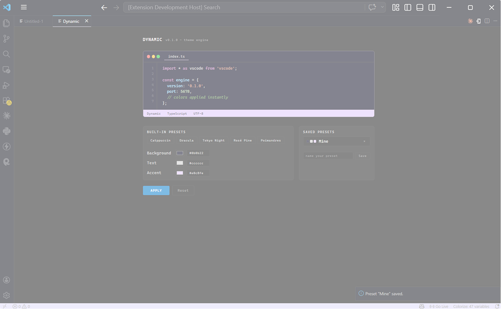

<p align="center">
  
</p>

<h1 align="center">Dynamic Theme</h1>

<p align="center">
  Build your own editor theme. Consistently. Everywhere.
</p>

<p align="center">
  
</p>

---

## Why

Switching between tools breaks focus.

You design in Figma, then code in your editor.
Different colors. Different contrast. Different feel.

Dynamic makes your environment **consistent**.

---

## What

Dynamic is not a theme, it’s a **theme engine**.

### Usage
Pick your colors:
- background
- text
- accent

Apply → your editor updates instantly.

### Presete

Start fast? Select Built-in presets or can customize them

- Catppuccin
- Dracula
- Tokyo Night
- Rosé Pine
- Poimandres

---

## Installation

### VS Code

- Open Extensions (`Ctrl + Shift + X`)
- Search **Dynamic Theme**
- Install

### Cursor / Windsurf

```bash
cursor --install-extension dynamic-theme-0.1.0.vsix
windsurf --install-extension dynamic-theme-0.1.0.vsix

### Manual

Download .vsix from:
https://github.com/monfortbrian/dynamic-theme/releases

### Support

Works with:
- VS Code
- Cursor
- Windsurf
- Any VS Code-compatible editor

---

## Author

Monfort Brian
https://github.com/monfortbrian

---

## License

MIT
